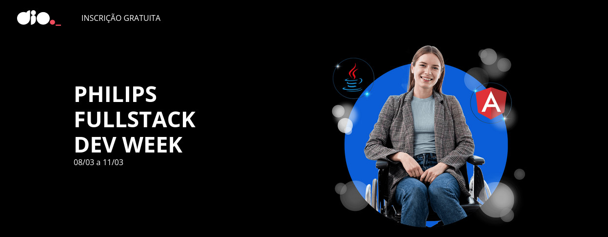

# PHILIPS-FULLSTACK-DEV-WEEK
Códigos Desenvolvidos durante o [Bootcamp PHILIPS FULLSTACK DEV WEEKs](https://www.dio.me/dev-week/philips/fullstack), realizado nos dias 08/03/2022 à 11/08/2022.

##Objetivo

Construir um sistema que permitirá acesso aos dados, persistidos no Mysql, via API Web.

O Sistema irá fornecer acesso aos dados de exames de mamografia feitos por Brasileiras em território nacional.

##Conceitos Abordados:

- Banco de Dados relacional;
- Ambientes de desenvolvimento: Intellij e VS Code;
- Framework Java Springboot - backend;
- Framework JS Angular - API Web;
- Integração Back/Frontend.

